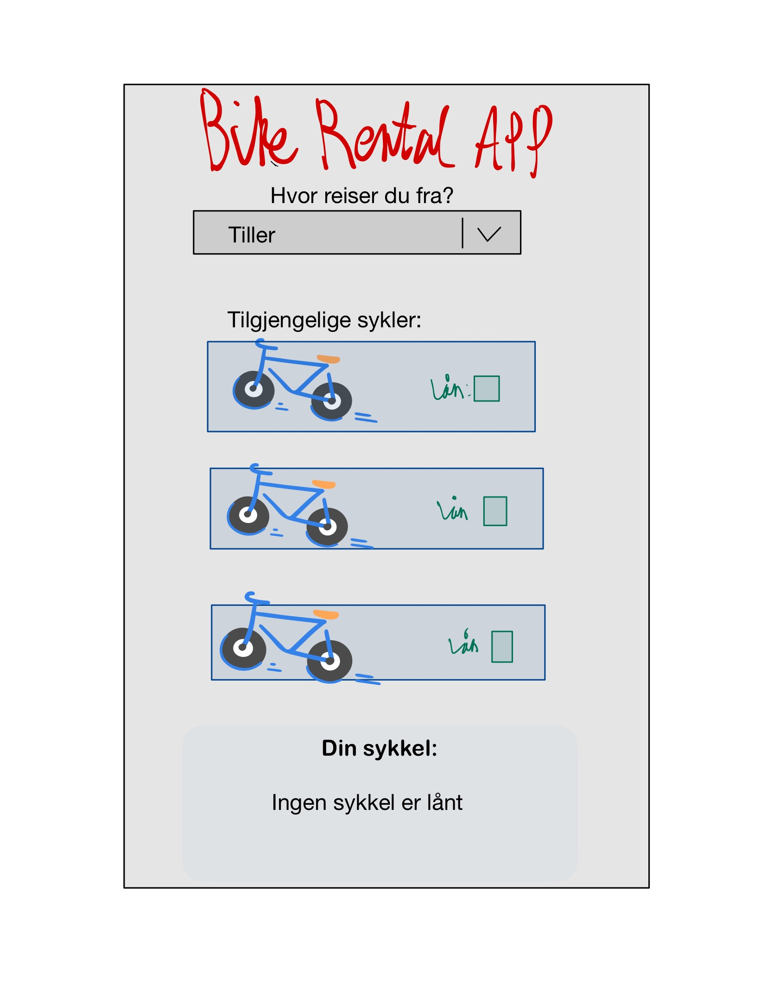
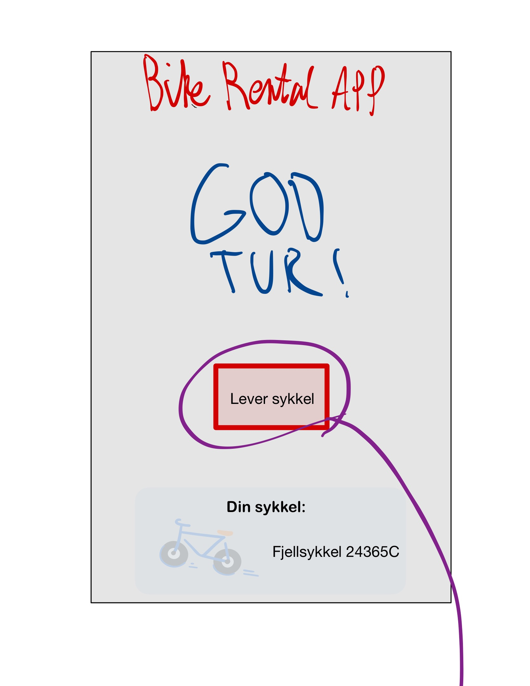
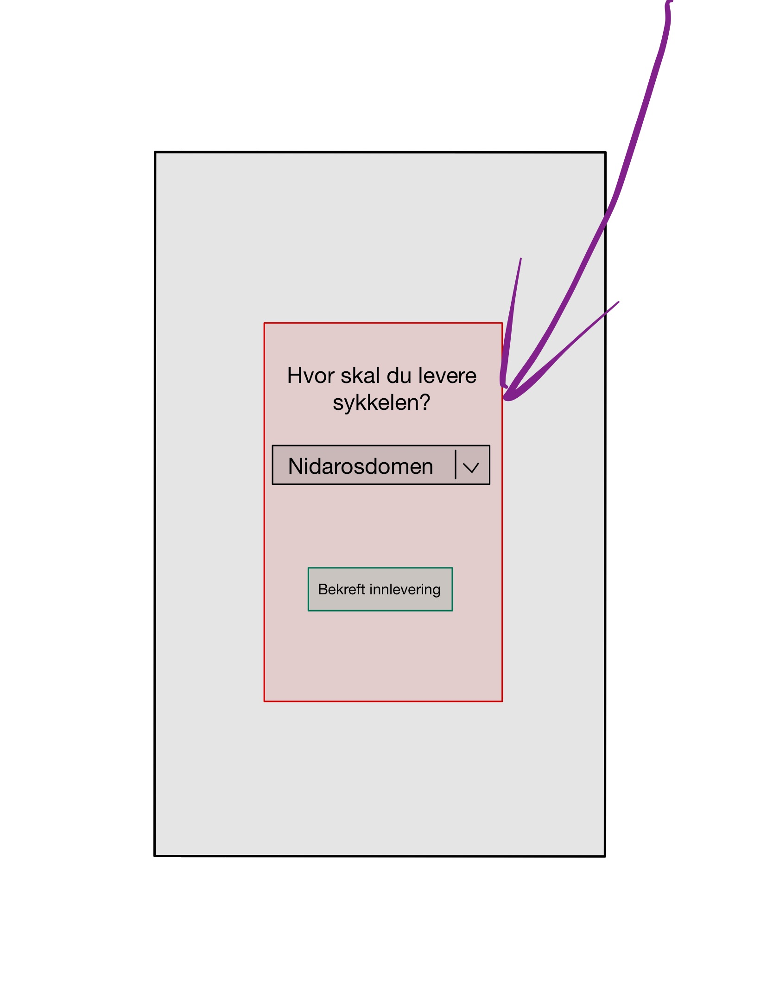

# Applikasjonens funksjon 

*En README.md-fil (evt. en fil som README.md lenker til) inni kodingsprosjektet skal beskrive hva appen handler om og er ment å gjøre (når den er mer eller mindre ferdig). Ha med et illustrerende skjermbilde, så det er lettere å forstå. Det må også være minst én brukerhistorie for funksjonaliteten dere starter med.*

BikeRentalApp er en applikasjon for korttids- (og muligens) langtidsleie av sykler i Trondheim. 
Trondheim Bysykkel's nr. 1 utfordrer?

Kortidsleie av en ledig sykkel startes ved et tastetrykk, og gjøres ved et av BikeRentalApps mange utleiesteder. 
Like enkelt er det å levere! 

## Sykkler:
Applikasjonen vil tilby et bredt utvalg av sykkeltyper for utleie:
- Landeveissykkel 
- Terrengsykkel
- Elektrisk terrengsykkel 
- Fjellsykkel
- Fatbike 
- Elektrisk fatbike
- Barnesykkel 
- Tandemsykkel
- Elektrisk tandemsykkel
- Christiania sykkel  

## Utleiesteder:
For å være tilgjengelig for Bike Rental App's kunder, er vi tilgejngelige der du er!
- Tiller
- Nidarosdomen
- Gløshaugen
- Lade
- Munkholmen 

## Skjermbilde

## Brukerhistorie-1

Som en tidsskvist hverdagspendler ønsker jeg å kunne sykle til og/eller fra jobb, uten å måtte forplikte meg til å sykle begge veier. 

#### Personas

Petter (36 år) hadde en svært aktiv livstid, men har vært på latsia de siste årene. Han ønsker å få mer aktivitet inn i hans ellers travle hverdag. Den tiden har alikevell bruker på pendling til jobb, kunne tenker Petter likegreit kunne blitt brukt til fysisk aktivtet! Grunnet jobbsituasjon og privatliv er det ikke alltids Petter kan sykle begge veier, derfor er det gunstig å kunne være fleksibel. 

Petter bor på Tiller, men arbeider like ved Nidarosdomen - en lang pendlertur han likegodt kan bruke på å holde helsen ved like. 
Ettersom Petter er ganske ukjent med sykkel som fremkomstmiddel, men regner med å ha stor progresjon, ønsker han å kunne prøve ulike typer sykler uten å måtte forplikte seg til en gitt modell. 

### Viktig å kunne se
En oversikt over tilgjengelige sykler på de ulike utleieområdene. 
En oversikt over ulike tilgjengelige sykkeltyper.
Hvilken sykkel du leier. 
Hvilken bruker du er logget inn med. 

### Viktig å kunne gjøre 
Leie og levere en sykkel ved ulike utleieområder. 

## Brukerhistorie-2

Som uerfaren sykler ønsker jeg å kunne leie å leie en sykkel for å få mer fysisk aktivitet inn i min ellers travle pendlerhverdag. 

### Personas
