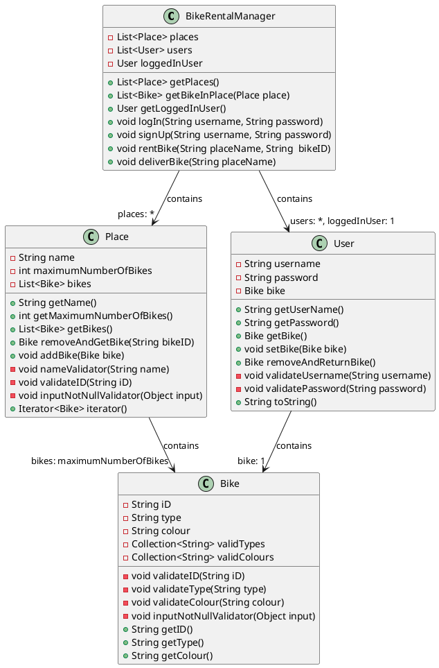

```plantuml
@startuml
BikeRentalManager --> "places: *" Place : contains
BikeRentalManager --> "users: *, loggedInUser: 1"  User : contains
Place --> "bikes: maximumNumberOfBikes" Bike : contains
User --> "bike: 1" Bike : contains

Class BikeRentalManager {
    -List<Place> places
    -List<User> users
    -User loggedInUser
    +List<Place> getPlaces()
    +List<Bike> getBikeInPlace(Place place)
    +User getLoggedInUser()
    +void logIn(String username, String password)
    +void signUp(String username, String password)
    +void rentBike(String placeName, String  bikeID)
    +void deliverBike(String placeName)
}

Class Place {
    -String name
    -int maximumNumberOfBikes
    -List<Bike> bikes
    +String getName()
    +int getMaximumNumberOfBikes()
    +List<Bike> getBikes()
    +Bike removeAndGetBike(String bikeID)
    +void addBike(Bike bike)
    -void nameValidator(String name)
    -void validateID(String iD)
    -void inputNotNullValidator(Object input)
    +Iterator<Bike> iterator()
}

Class User {
    -String username
    -String password
    -Bike bike
    +String getUserName()
    +String getPassword()
    +Bike getBike()
    +void setBike(Bike bike)
    +Bike removeAndReturnBike()
    -void validateUsername(String username)
    -void validatePassword(String password)
    +String toString()
}

Class Bike {
    -String iD
    -String type
    -String colour
    -Collection<String> validTypes
    -Collection<String> validColours
    -void validateID(String iD)
    -void validateType(String type)
    -void validateColour(String colour)
    -void inputNotNullValidator(Object input)
    +String getID()
    +String getType()
    +String getColour()
}
@enduml
```