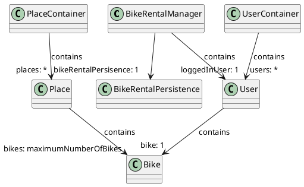

# Dokumentasjon - release 1

I denne releasen er følgende utarbeidet og/eller implementert:
- [Brukerhistorier](../2247/readme.md)
- [Personas](../2247/readme.md)
- Planlagt hovedmodell (se klassediagram under)
- [Prototype](../2247/readme.md)
- Bygget prosjektet i Maven
- Støtte for utvikling i [GitPod](https://gitpod.stud.ntnu.no/#https://gitlab.stud.idi.ntnu.no/it1901/groups-2022/gr2247/gr2247)
- Lagt til støtte for javafx, testing og json i [pom.xml](../2247/pom.xml)
- [Brukergrensesnitt](../2247/src/main/resources/bikeRentalApp/core/BikeRentalApp.fxml)
- En fungerende [modell](../2247/src/main/java/bikeRentalApp/core/) for begrenset funksjonalitet basert på brukerhistoriene
- En [controller-klasse](../2247/src/main/java/bikeRentalApp/core/BikeRentalAppController.java) som knytter brukergrensesnittet til foreløpig funksjonalitet i modell
- En [test for User-klassen](../2247/src/test/java/bikeRentalApp/core/UserTest.java)
- [Serialiserere og deserialiserere](../2247/src/main/java/bikeRentalApp/json/) for klassene til støtte for lagring av tilstand i JSON-format
- [Lagring av tilstand](../2247/src/main/java/bikeRentalApp/json/BikeRentalPersistence.java)
- Støtte for JaCoCo, funksjonalitet for rapportering av støttedekningsgrad

## Klassediagram over modellen, slik som den er i release 1:

