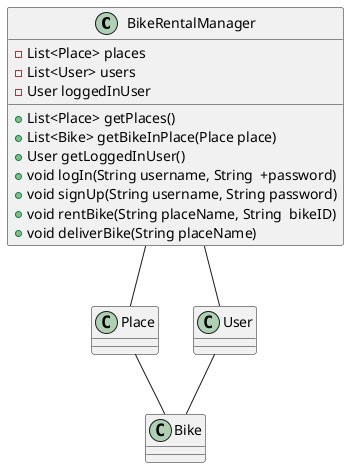

```plantuml
@startuml
BikeRentalManager -- Place
BikeRentalManager -- User
Place -- Bike
User -- Bike

Class BikeRentalManager {
    -List<Place> places
    -List<User> users
    -User loggedInUser
    +List<Place> getPlaces()
    +List<Bike> getBikeInPlace(Place place)
    +User getLoggedInUser()
    +void logIn(String username, String  +password)
    +void signUp(String username, String password)
    +void rentBike(String placeName, String  bikeID)
    +void deliverBike(String placeName)
}
@enduml
```