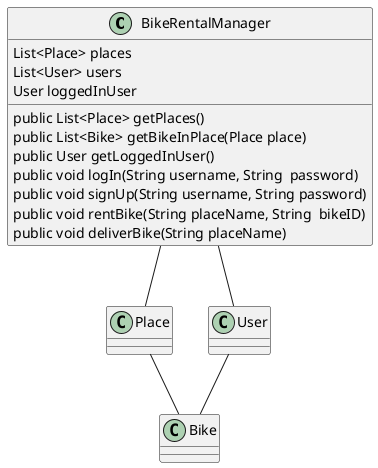

```plantuml
@startuml
BikeRentalManager -- Place
BikeRentalManager -- User
Place -- Bike
User -- Bike

Class BikeRentalManager {
    List<Place> places
    List<User> users
    User loggedInUser
    public List<Place> getPlaces()
    public List<Bike> getBikeInPlace(Place place)
    public User getLoggedInUser()
    public void logIn(String username, String  password)
    public void signUp(String username, String password)
    public void rentBike(String placeName, String  bikeID)
    public void deliverBike(String placeName)
}
@enduml
```