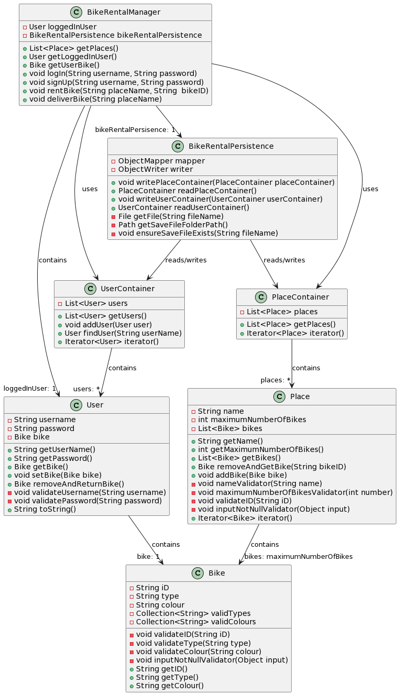
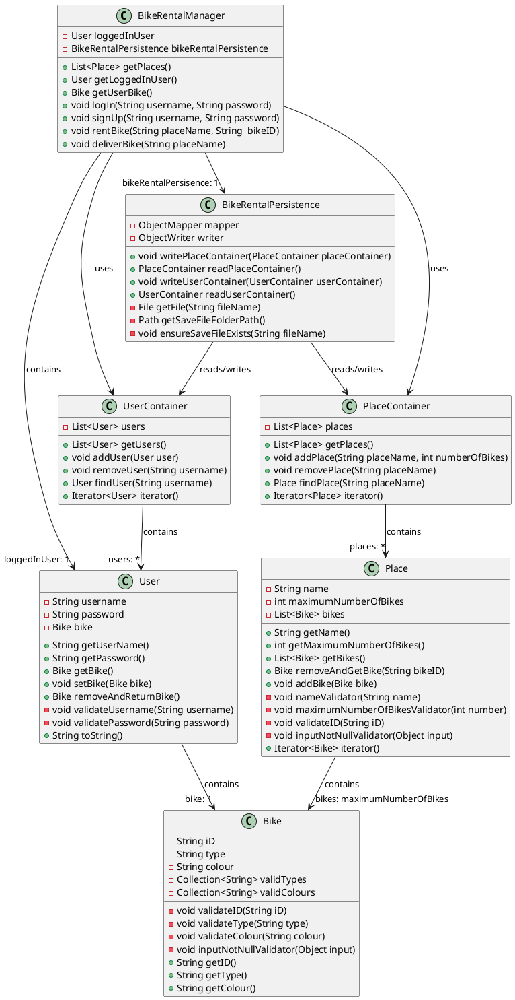

# Dokumentasjon - release 2

I denne releasen er følgende utarbeidet og/eller implementert:
- Javadocs for følgende klasser:
  - Bike
  - BikeRentalAppController
  - BikeRentalManager
  - Place
  - PlaceContainer
  - User
  - UserContainer
- Testing av klasser i prosjektet:
  - [BikeRentalManagerTest](../2247/core/src/test/java/bikerentalapp/core/BikeRentalManagerTest.java)
  - [BikeTest](../2247/core/src/test/java/bikerentalapp/core/BikeTest.java)
  - [PlaceTest](../2247/core/src/test/java/bikerentalapp/core/PlaceTest.java)
  - [UserContainerTest](../2247/core/src/test/java/bikerentalapp/core/UserContainerTest.java)
  - [UserTest](../2247/core/src/test/java/bikerentalapp/core/UserTest.java)
  - [AppTest](../2247/fxui/src/test/java/bikerentalapp/ui/AppTest.java)
  - [BikeRentalModuleTest](../2247/core/src/test/java/bikerentalapp/json/BikeRentalModuleTest.java)
- Prosjektet er modularisert og bygget på 3-lags arkitektur med egne pom-filer
- Implementasjon av Spotbugs og Checkstyle
- Persistens ved hjelp av JSON filer (Filene, places.json og users.json, er per nå lagret flere stedet i prosjektet. Dette skal fikses til neste release)
- Rimelig god testdekning i JACOCO
- Dokumentasjon knyttet til arbeidsvaner

---

Vi har ikke endret/lagt til noe funskjonalitet (med unntak av bug-fixing) i selve applikasjonen i denne releasen. Dermed er funksjonaliteten foreløpig fremdeles basert på [brukerhistorie 1](../2247/readme.md#brukerhistorie-1).

Funksjonalitet i applikasjonen:
- Registrere ny bruker med passord
- Logge inn med eksisterende bruker
- Leie ledig sykkel fra ønsket sted
- Levere tilbake sykkel på ønsket sted

---

## Oppdatert klassediagram over modellen (core), slik som den er i release 2:

(For enkelthetens skyld  har vi unlatt å vise de mange serialisererne og deserialisererne som benyttes)

 

