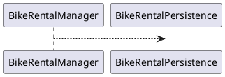

# Dokumentasjon - release 2

I denne releasen er følgende utarbeidet og/eller implementert:
- Javadocs for følgende klasser:
  - Bike
  - BikeRentalAppController
  - BikeRentalManager
  - Place
  - PlaceContainer
  - User
  - UserContainer
  - Serializer
  - Deserializer
  - 

## Oppdatert klassediagram over modellen, slik som den er i release 2:

