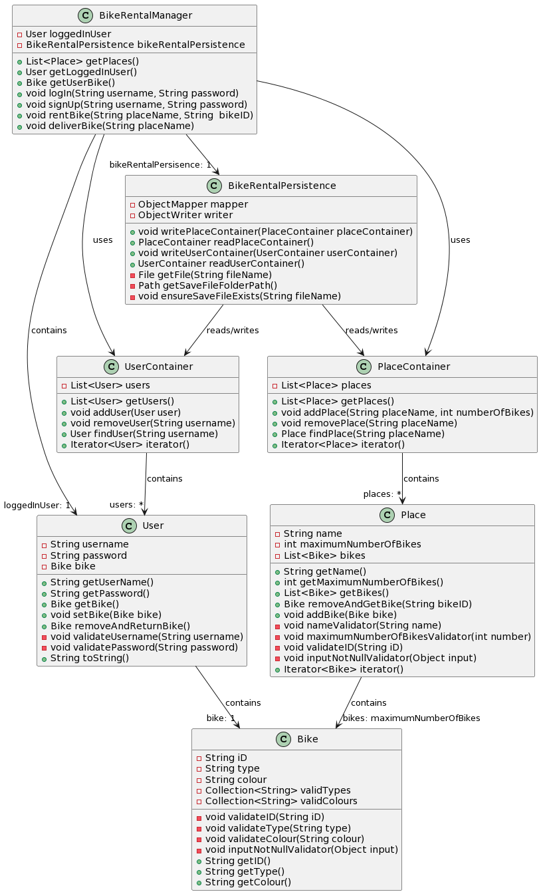

# Dokumentasjon - release 2

I denne releasen er følgende utarbeidet og/eller implementert:
- Javadocs for følgende klasser:
  - Bike
  - BikeRentalAppController
  - BikeRentalManager
  - Place
  - PlaceContainer
  - User
  - UserContainer
  - Serializer
  - Deserializer
- Testing av klasser i prosjektet:
  - [BikeRentalManagerTest](../2247/core/src/test/java/bikeRentalApp/core/BikeRentalManagerTest.java)
  - [BikeTest](../2247/core/src/test/java/bikeRentalApp/core/BikeTest.java)
  - [PlaceTest](../2247/core/src/test/java/bikeRentalApp/core/PlaceTest.java)
  - [UserContainerTest](../2247/core/src/test/java/bikeRentalApp/core/UserContainerTest.java)
  - [UserTest](../2247/core/src/test/java/bikeRentalApp/core/UserTest.java)
  - [AppTest](../2247/fxui/src/test/java/bikeRentalApp/ui/AppTest.java)
- Prosjektet er modularisert og bygget på 3-lags arkitektur med egne pom filer
- Implementasjon av Spotbugs og Checkstyle
- Persistens ved hjelp av JSON filer
- Rimelig god testdekning i JACOCO
- Dokumentasjon knyttet til arbeidsvaner

## Oppdatert klassediagram over modellen (core), slik som den er i release 2:

(Midlertidig bilde, inntil plantUML-implementasjonen fungerer.)
(For enkelthetens skyld  har vi unlatt å vise de mange serialisererne og deserialisererne som benyttes)

 

