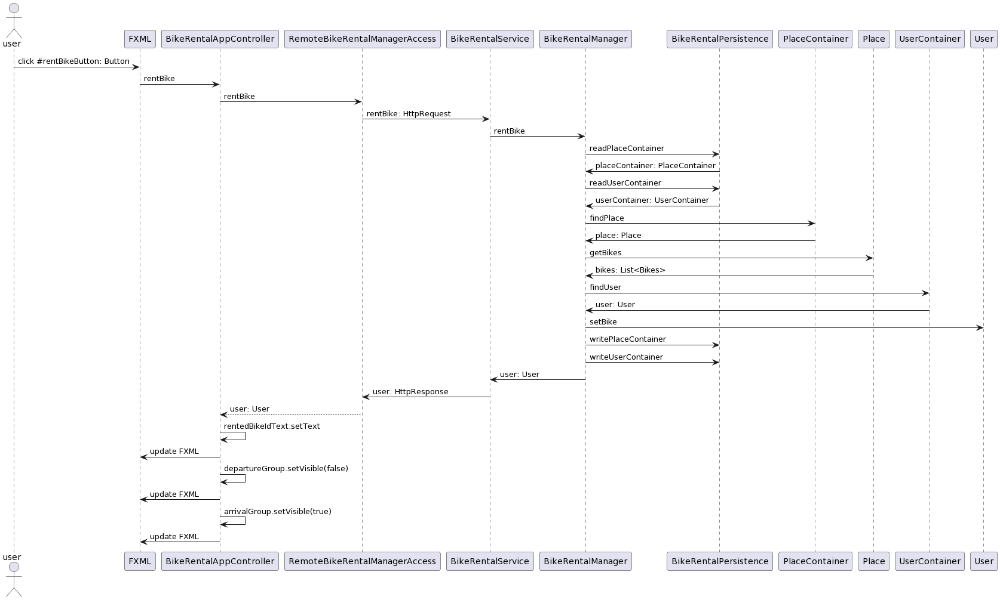

# Dokumentasjon - release 3

I denne releasen er følgende utarbeidet og/eller implementert:
- Utvidet applikasjonsfunksjonaliteten knyttet til profilside og endring av passord.
  -  Denne funksjonalitet har inkludert testing, metoder og kobling til allerede etablert applikasjon. Den utvidede funksjonaliteten har også egen controller og testklasse.
- Resterende JavaDoc og feilrettinger for prosjektet.
- Testing av klasser i prosjektet:
    - 
- Prosjektet er modularisert og koblet opp mot REST API
  - Prosjektet bruker web-server som tar imot http-requests definert i BikeRentalService
  - BikerRentalSevice kaller metoder i BikeRentalManager for å få tilgang til funksjonalitet i modellen
  - Ytterligere informasjon om implementasjon finnes i readme i rest-modulen
- Prosjektet har implementert jlink og jpackage og kan eksportere et shippable produkt.
-  Spotbugs og Checkstyle i prosjektet har 100% dekningsgrad.
-  Høy testdekningsgrad i JACOCO. Dette er mye bedre testdekning enn i release 2. Her gjenstår kun dekning av unntakshåndtering utenfor testens kontroll (Feks. korrupte filer, systemfeil eller andre former for IOexceptions).
- Diagrammer:
  - [Pakkediagram](../../2247/skjermbilder/PakkeDiagram.png) av løsning
  - Sekvensdiagram for å låne en sykkel (Se bilde under)
  - Klasse for hver enkelt modul finnes i readme filen i tilsvarende modul.

 "Sekvensdiagram for å låne en sykkel"

---

I denne releasen er applikasjonen utvidet med profilside funksjonalitet knyttet opp til [brukerhistorie-2](../../2247/readme.md#brukerhistorie-2). Her ønsket vi også å implementere lånehistorikk, men grunnet manglende gruppemedlem og diskusjon med studass ble det bestemt å kun utvide applikasjonens funksjonalitet med utlogging og passordendring på profilsiden.

Funksjonalitet i applikasjonen:
- *Registrere ny bruker med passord*
- *Logge inn med eksisterende bruker*
- *Leie ledig sykkel fra ønsket sted*
- *Levere tilbake sykkel på ønsket sted*
+ Bruker har mulighet til å endre passord
+ Bruker har mulighet til å logge ut av applikasjonen

---